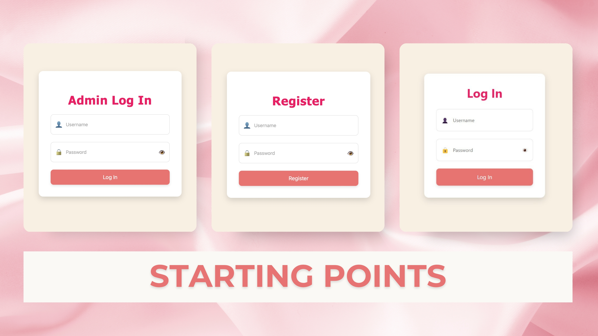
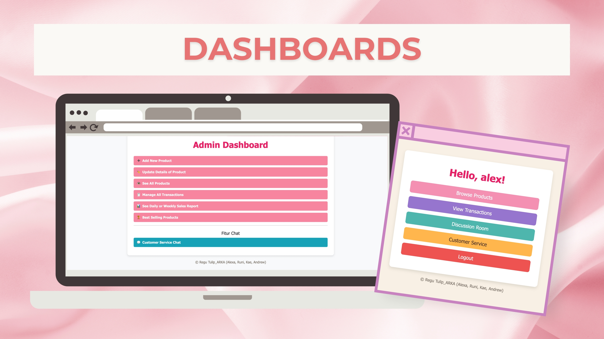
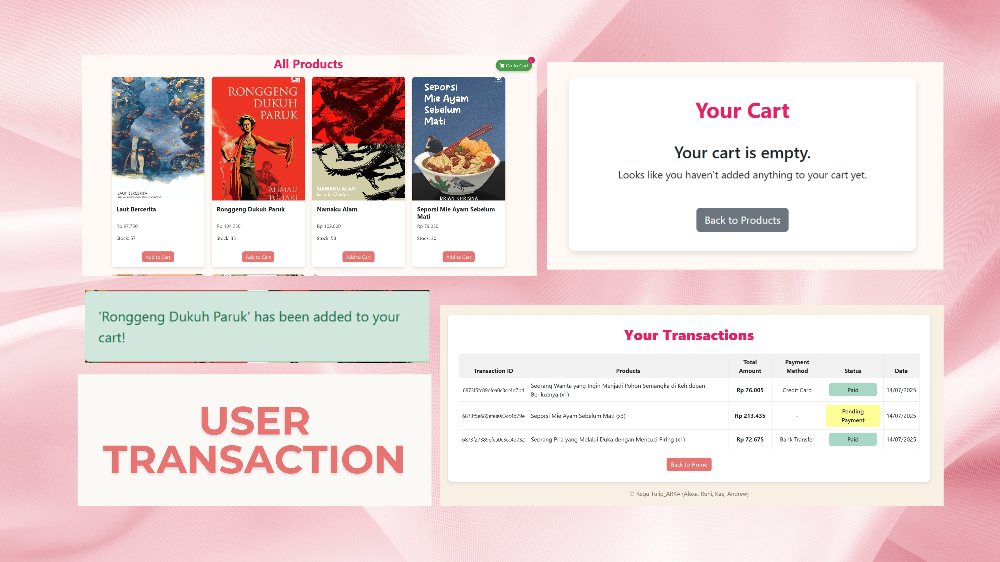
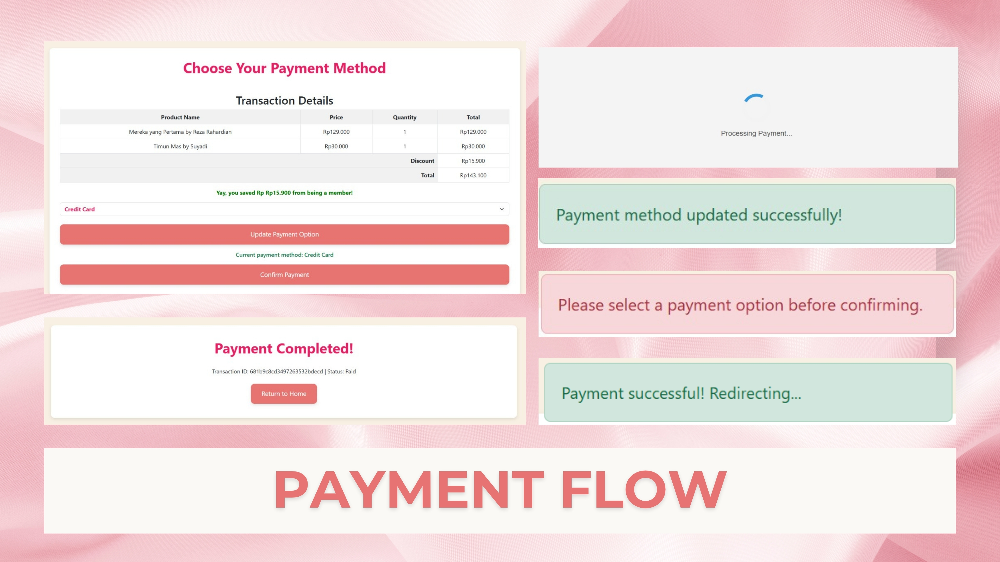
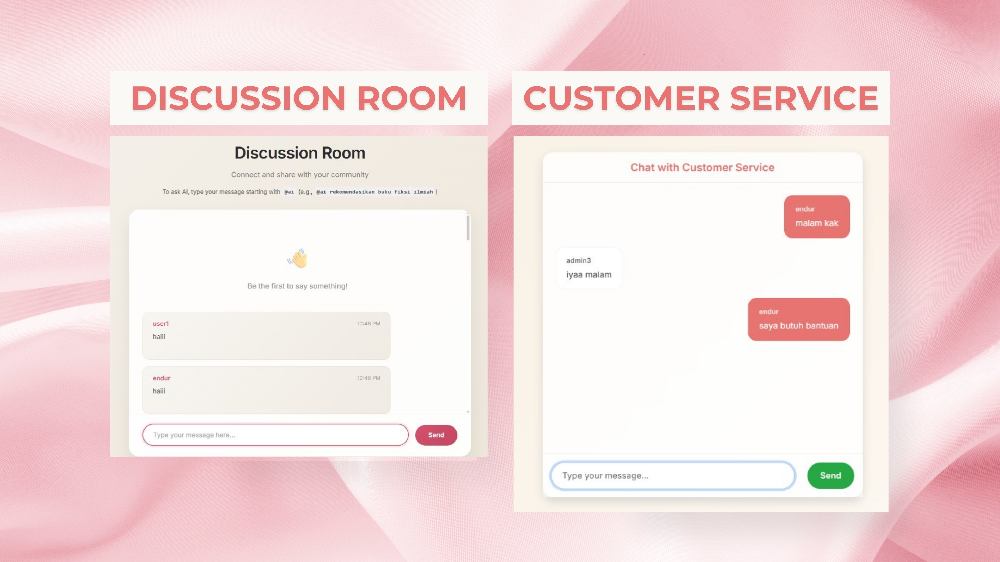
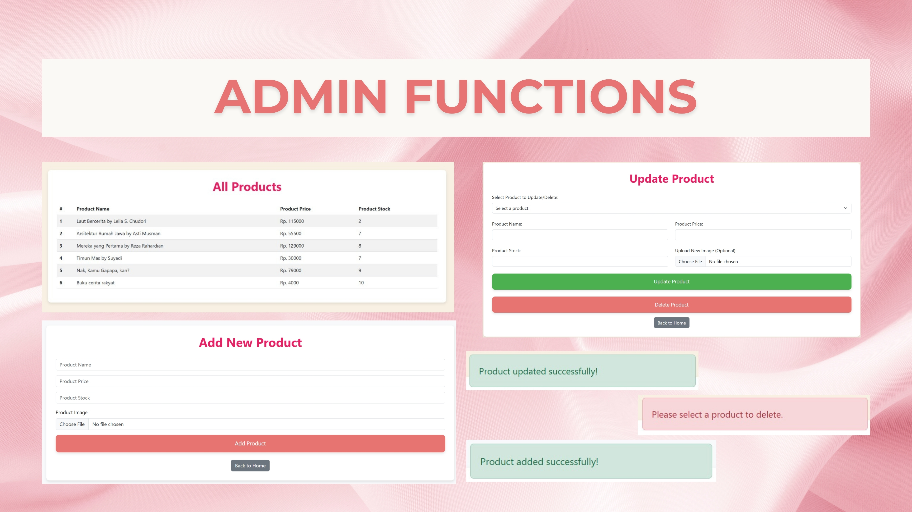
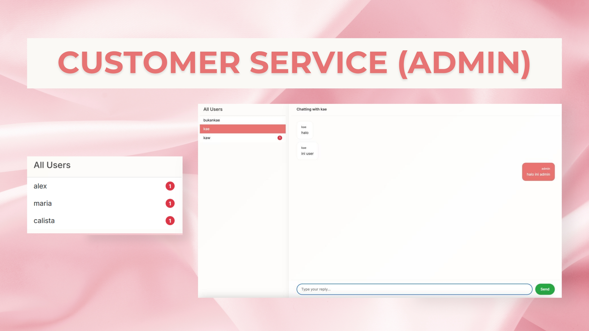
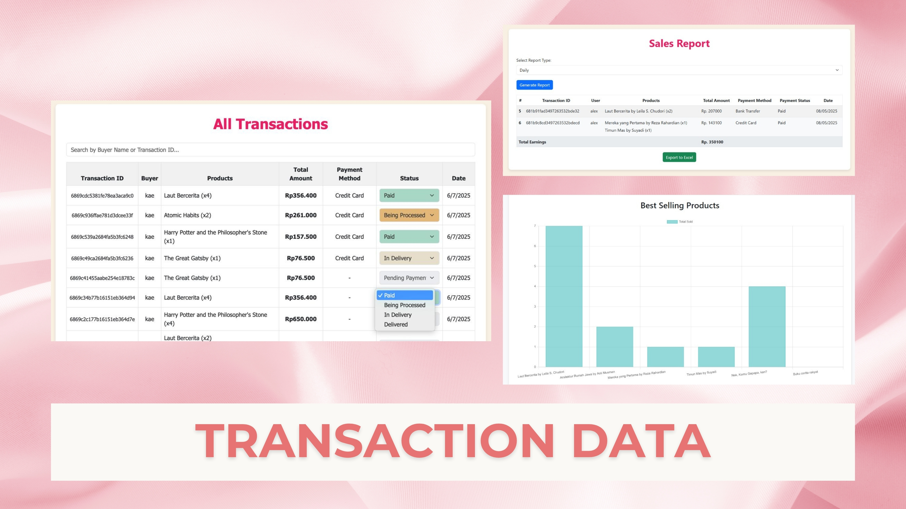

# 📚 LiteraTulip - Node.js Book Ordering Web App 🌷
<table>
  <tr>
    <td width="100%">
      
       
    </td>
  </tr>
</table>

A simple and efficient web application built with Node.js, Express, and MongoDB that allows users to browse, order, and manage books online.
> This web app was developed as a Midterm and Final Project for SFT 208 - Web-based Programming Course by ARKA (Andrew, Runi, Kae, Alexa).

## 🚀 Features
🧾 User registration and login (with session-based authentication)  
📖 Browse available books  
💰 Applied Discounts to Registered Users  
🛒 Add books to cart and place orders  
💳 Payment simulation with order status tracking  
🗂 Admin dashboard to manage books, view orders, view Best-selling Books, and manage transactions  
💬 Chatting feature between Users, AI, and the Admin (Customer Service)

## 🛠 Tech Stack
Backend: Node.js, Express.js, Socket.io  
Database: MongoDB + Mongoose  
Frontend: HTML, CSS, Bootstrap  
Authentication: Express-session

## 📂 Folder Structure
├── models/   # Mongoose schemas (User, Admin, Produk, Transaksi)  
├── routes/   # Express routes  
├── controllers/   # Business logic  
├── public/   # Frontend (CSS, JS, images)  
├── server.js # Main server entry point  
├── .env      # Environment variables (e.g., database URI, Gemini API Key)  
├── package.json

## 🧪 Getting Started
git clone https://github.com/teresakae/LiteraTulip.git 
OR **download and extract UTSPBW - ARKA (Final).zip**
npm install  
npm run start 

Visit `http://localhost:3000/start.html` to **explore the app as a User**  
or `http://localhost:3000/admin-login.html` **as an Admin**

✅ Future Improvements
* More book attributes (descriptions, category, authors, publishers, etc.)  
* Integration with real payment gateways  
* Search features, more dynamic UI, filtering

## 📸 Screenshots
<table>
  <tr>
    <td width="50%" style="text-align: center;">
      
       
      <em>1. Login Page</em>
    </td>
    <td width="50%" style="text-align: center;">
      
       
      <em>2. Dashboards</em>
    </td>
  </tr>
  <tr>
    <td width="50%" style="text-align: center;">
      
       
      <em>3. User Transactions</em>
    </td>
    <td width="50%" style="text-align: center;">
      
       
      <em>4. User Payment Flow</em>
    </td>
  </tr>
  <tr>
    <td width="50%" style="text-align: center;">
      
       
      <em>5. User Chat Interface</em>
    </td>
    <td width="50%" style="text-align: center;">
      
       
      <em>6. Admin Product Management</em>
    </td>
  </tr>
  <tr>
    <td width="50%" style="text-align: center;">
      
       
      <em>7. Admin Chat Interface</em>
    </td>
    <td width="50%" style="text-align: center;">
      
       
      <em>8. Admin Transactions Summary</em>
    </td>
  </tr>
</table>
